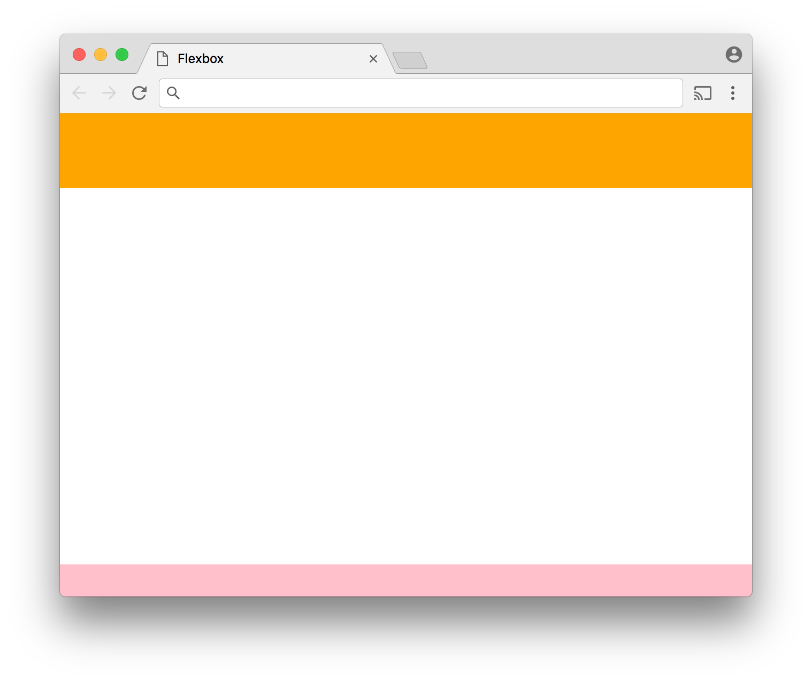
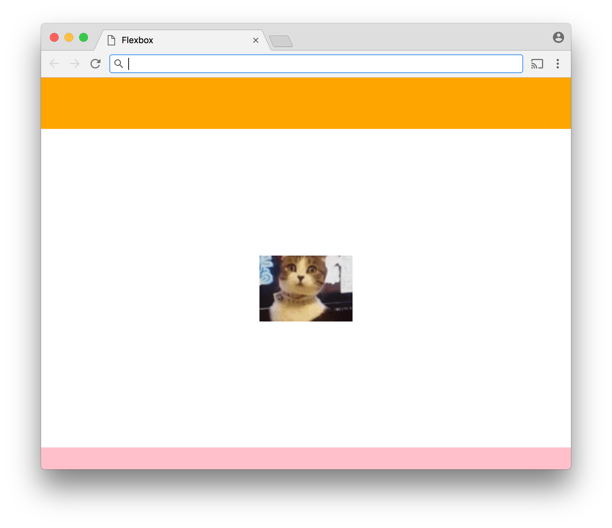

# Flexbox

[Flexbox](https://developer.mozilla.org/en-US/docs/Web/CSS/CSS_Flexible_Box_Layout/Using_CSS_flexible_boxes) is the name given to a new layout system available in CSS. With Flexbox, you specify in CSS how a containing element (a flex container) should allocate available space to its direct children (flex items). The container can grow or shrink the items within it to make the best use of the space available. Flexbox is particularly well suited to creating layouts that work across a variety of screen sizes. It also makes [many layouts](https://philipwalton.github.io/solved-by-flexbox/) that were historically difficult to achieve with CSS much easier.

To make an element a flex container, set it's `display` property to `flex` (or `inline-flex` if you want the container to behave as an inline element). With the `display` set thus, the children of the element become flex items. The following properties can be added to the container to specify how the items should be laid out:

- `flex-direction` - specifies the direction in which the items should flow. Possible values are `row` (left to right), `row-reverse` (right to left), `column` (top to bottom), and `column-reverse` (bottom to top). The default is `row`.
- `justify-content` - specifies how content is aligned and extra space distributed on the main axis (i.e., the axis specified by the `flex-direction` property). Possible values are `space-between` (the first item at the very beginning of the main axis, the last item at the very end, and the items in between separated by empty space), `space-around` (like `space-between` but with empty space before the first item and after the last), `center` (items clustered in the center), `flex-start` (items clustered at the beginning of the main axis), and `flex-end` (items clustered at the end of the main axis). 
- `align-items` - like `justify-content` but for the cross axis (which is the opposite axis of the main axis. If the `flex-direction` is `row` or `row-reverse`, the `align-items` property specifies vertical alignment. Otherwise, it specifies horizontal alignment). The possible values are `flex-start`, `flex-end`, `center`, `baseline` (the baselines of items are aligned), and `stretch` (the items are stretched to fill the container cross axis).
- `flex-wrap` - specifies whether and how items should wrap. Possible values are `nowrap`, `wrap`, and `wrap-reverse`. The default is `nowrap`.
- `align-content` - specifies how the lines of items should be spaced when wrapping is enabled. Possible values are `flex-start`, `flex-end`, `center`, `space-between`, `space-around`, and `stretch`.

There are also properties you can add to the individual flex items to control their alignment, sizing, and order of appearance.

- `order` - An integer that specifies the order in which an item should appear. The default value is `0`, which indicates that the item should appear in the order in which appears in the source HTML. A lower value indicates that the item should appear earlier and a higher value indicates that the item should appear later.
- `flex-basis` - Specifies the default size of an item before resizing.  Can be a specific value specified in units such as `px` or `%`. The default value is `auto`.
- `flex-grow` - A number greater than or equal to zero that specifies the factor by which the item should grow if there is space available. If a flex item has its `flex-grow` property set to `2` while all the other flex items have a `flex-grow` of `1`, it will be twice the size as all the others.
- `flex-shrink` - A number greater than or equal to zero that specifies the factor by which item should shrink if required.
- `flex` - Allows you to specify `flex-grow`, `flex-shrink`, and `flex-basis` (in that order) in one go. The `flex-shrink` and `flex-basis` values can be omitted.
- `align-self` - Allows you to override the flex container's `align-items` property for this individual item.

[CSS Tricks](https://css-tricks.com/snippets/css/a-guide-to-flexbox/) has a more thorough [guide to Flexbox](https://css-tricks.com/snippets/css/a-guide-to-flexbox/) featuring diagrams and demos. It is highly recommended that read it over and refer to it as you complete the exercises.

## Exercies

1. There's a fun game called [Flexbox Froggy](http://flexboxfroggy.com/) that will help you master Flexbox. Warning: it gets kind of hard at the end.

2. Create an HTML document with three elements in the `<body>` tag: a `<header>` element, a `<main>` element, and a `<footer>` element. The `<body>` should be made a flex container and have its `min-height` set to `100vh` so it fills the browser window. The `<header>` element should have a solid background color and be 70 pixels tall. The `<footer>` element should have a solid background color and be 30 pixels tall. The `<main>` element should fill the remainder of the available space.

   

3. Copy the HTML document you created and add to the `<main>` element a single `` tag with its `src` attribute set to `https://bubble-medicine.glitch.me/gif?tag=kitty`. This url uses the [Giphy API](http://api.giphy.com/) to get a random gif so it will not be possible to know the width and height of the image that will be displayed in advance. Make the `<main>` element a flex container and have the `` element appear centered vertically and horizontally.

   

4. Use Flexbox to reproduce the following design. Each outer box should be a flex container that contains only one flex item.

   

   ​
