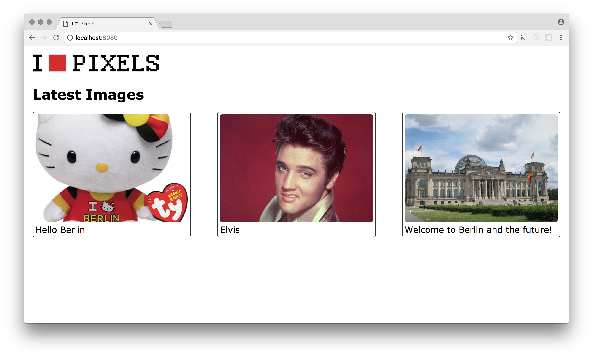

# Image Board SPA

## Overview

Imagine a site where anybody could go and post an image of their choosing, along with a title and a textual description of that image, and others could go and look at that image and make thoughtful remarks about it. We have the technology to make this vision a reality.

This will be a single-page application made with [Vue.js](../vuejs).

## Part 1

For part 1 we want to create the main screen that users see when they arrive at the site. They should see a screen with the 6 to 12 most recently uploaded images. These should be shown as 'cards' arranged in a grid on larger screens and a column on smaller screens.

Each card should show the scaled-down image and its title.

Ultimately we will have to add some mechanism for pagination (either with buttons or infinite scroll). This will be difficult to implement while we only have three images to show. It will be easier to do after [part 2](../imageboard2) is completed.

In your Javascript you will have to create a `Vue` instance and when it mounts make an ajax request to get the data for the images. Once you have it, your HTML template should loop through them and render each one.
