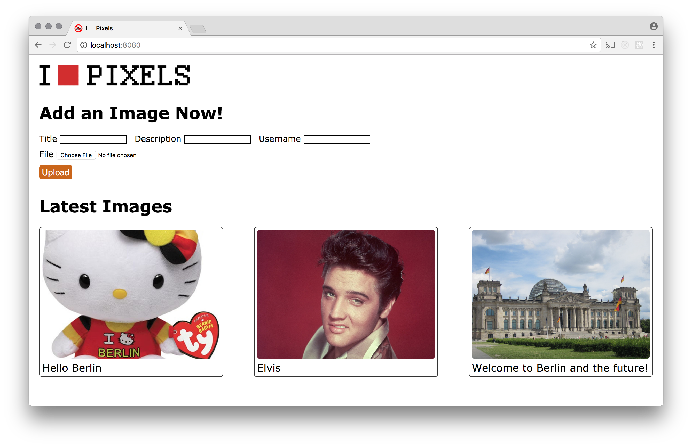

# Image Board - Part 2

The next step is to add a form with which the user can upload an image. It is not necessary to use an actual `<form>` element for this, since we will be using ajax to submit the data.

Four fields are required: image title, image description, username, and a file input for the image itself. A submit button is also required.

For the three text fields, you can use the `v-model` directive to automatically collect the values that the user enters. For the file input, you will have to handle the `"change"` event and manually set a property on the instance to contain the file.

When the user clicks the submit button, a POST request containing all of the data should be made. If the image upload is successful, the server should respond with a payload containing the url of the image. When the client receives this response, it should update the list of images it already has to include the image that was just uploaded. This should cause automatic re-rendering of the list of images with the newest image now appearing.
