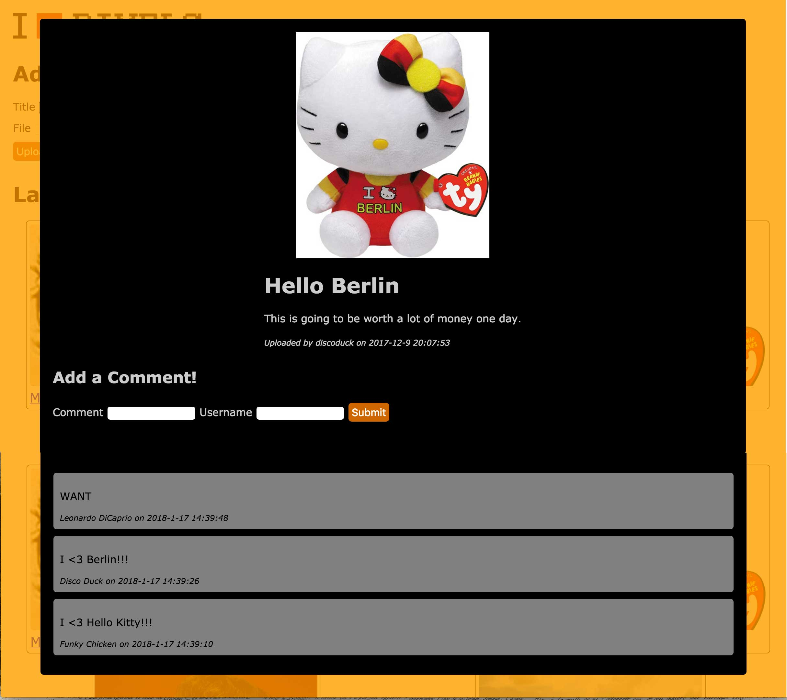

# Image Board - Part 3

When users click on on one of the images displayed as a card on our main page, we want to pop open a modal that shows the image in a larger size. In addition to the larger sized image, we also want to display the title of the image, the description of the image, and the name of the user who uploaded it.

We also want to show all of the comments that have been made about the image. There should also be form fields present with which the user can add a comment - we need a field for users to enter their name as well as the comment itself. When a use submits a comment, that comment should appear in the list of comments.

The modal should be implemented as a [Vue component](../vuejs/components.md). When the user clicks on one of the images, our main `Vue` instance should set a property on itself that makes the modal appear.

When the modal component mounts, at least one ajax request will have to be made. It will have to make a request to get any data for the image it does not already have as well as all of the comments for the image. To be able to get this data, the component will need to know at least the id of the image. The id of the image will have to be passed to the component as a prop.

There also needs to be a way to close the modal. You can add to it an X button or make it disappear when the user clicks outside of it. Either way, the component won't be able to change the property of its parent that made it appear. It will have to emit an event that our `Vue` instance listens for so that it can know when to hide the modal.
