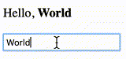
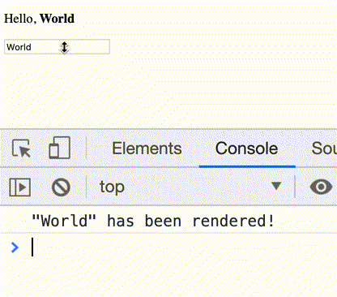

# Hooks

[Hooks](https://reactjs.org/docs/hooks-intro.html) are a new React feature for which there is currently a great deal of enthusiasm. The excitement is because hooks allow you to

* Use function components where previously you were compelled to use class components

* Share common behavior across components without needing to pass it from parent to child

It is the first point that we will focus on in this brief introduction.

## What are hooks?

Hooks are functions that you can call inside a function component in order to bring into it some behavior or functionality that the hook provides. You can liken a call to a hook to a call to `require` or an `import` statement.

Hooks can only be used in function components and in other hooks. They do not work in class components.

Hooks should not be called in loops or conditionals. They should only be called in the top level of the functions in which they are used.

React comes with several [built-in hooks](https://reactjs.org/docs/hooks-reference.html) and it is also possible to write your own. The names of all the built-in hooks start with "use" and it is important that you maintain this convention when you write your own.

Two built-in hooks, [`useState`](https://reactjs.org/docs/hooks-state.html) and [`useEffect`](https://reactjs.org/docs/hooks-effect.html), are essential for writing function components that have the power of class components.

## `useState`

The [`useState`](https://reactjs.org/docs/hooks-state.html) Hook allows you to write function components that make use of state. You call `useState` once for every state property you want your component to use. For example, if you wanted your component to use state properties for first and last name, you would do the following:

```js
import React, { useState } from 'react';

function MyComponent() {
    const [first, setFirst] = useState('Funky');
    const [last, setLast] = useState('Chicken');

    /* ... */

}
```

From this example we can see that `useState` takes an argument and returns an array. The argument is the initial value you want the state property to have. The array it returns contains two things: the current value of the state property and a function that can be called to change the value of the state property. Let's look at an example in which both of these things are used.

```js
import React, { useState } from 'react';

function Hello() {
    const [greetee, setGreetee] = useState('World');

    return (
        <div>
            <p>
                Hello, <strong>{greetee}</strong>
            </p>
            <input onChange={e => setGreetee(e.target.value)} defaultValue={greetee} />
        </div>
    );
}
```

Let's say that, after this component renders for the first time, the user focuses the text field and hits the backspace key to delete the last letter. The `handleChange` function would then set the state property to the new value of the text field, "Worl." That state change would cause the component to render again (i.e., it would cause the `Hello` function to run another time). When it does, the new call to `useState` will return the new value for `greetee`, "Worl." It is that value that will appear in the `<strong>` element that is rendered. This process would repeat with each change to the text field that the user makes.



## `useEffect`
Apart from state, another reason one might choose to use a class component rather than a function component would be to use [lifecycle methods](https://reactjs.org/docs/react-component.html#the-component-lifecycle) such as [`componentDidMount`](https://reactjs.org/docs/react-component.html#componentdidmount), [`componentDidUpdate`](https://reactjs.org/docs/react-component.html#componentdidupdate), and [`componentWillUnmount`](https://reactjs.org/docs/react-component.html#componentwillunmount). The [`useEffect`](https://reactjs.org/docs/hooks-effect.html) hook provides a way to accomplish in a function component what you would want to accomplish by using those methods in a class component.

When you call `useEffect`, you pass it a function. The function that you pass will be called immediately after your component has been rendered.

```js
import React, { useState, useEffect } from 'react';

function Hello() {
    const [greetee, setGreetee] = useState('World');

    useEffect(() => {
        console.log(`"${greetee}" has been rendered!`);
    });

    return (
        <div>
            <p>
                Hello, <strong>{greetee}</strong>
            </p>
            <input onChange={e => setGreetee(e.target.value)} defaultValue={greetee} />
        </div>
    );
}
```


As this example makes clear, no distinction is made between the first render and subsequent renders. The function you pass to `useEffect` is called every time your component is rendered. If you only want to do something the first time your component is rendered, you must take steps to ensure that you don't end up doing it again.

To help with this, you can pass a second argument to `useEffect`, an array containing values used by the function you pass as the first argument. When you do this, the function you pass to `useEffect` will only be called if a value in the array is different from the corresponding value that was in the array the last time `useEffect` was called.

```js
import React, { useState, useEffect } from 'react';
import axios from 'axios';

function User({ id }) {
    const [user, setUser] = useState();

    useEffect(() => {
        (async () => {
            const {data} = await axios.get(`/user/${id}.json`);
            setUser(data.user);
        })();
    }, [id]);

    /* ... */
}
```

In this example, the HTTP request to get user information will be made when the component is first rendered and would only be made again if the component receives a new `id` prop from its parent.

If you want to guarantee that the function you pass to `useEffect` only runs when the component mounts, you can pass an empty array as the second argument. However, any values from the outer scope that you do use in the function you pass as the first argument to `useEffect` should be in the array you pass as the second argument. That is how React will know that it needs to run the function again. Since the function may run more times than you actually want it to, you may have to add logic to it to ensure the correct behavior.

So far we've seen how `useEffect` can be used to meet the needs that `componentDidMount` and `componentDidUpdate` satisfy in class components. To do the sort of cleanup that you might do in `componentWillUnmount`, you can return a function from the function that you pass to `useEffect`. React will call this function before every re-render of your component as well as when your component unmounts.

```js
import React, { useState, useEffect } from 'react';

function Hello() {
    const [greetee, setGreetee] = useState('World');

    useEffect(() => {
        console.log(`"${greetee}" has been rendered!`);
        return () => {
            console.log(`About to replace "${greetee}" with something else.`)
        };
    });

    return (
        <div>
            <p>
                Hello, <strong>{greetee}</strong>
            </p>
            <input onChange={e => setGreetee(e.target.value)} defaultValue={greetee} />
        </div>
    );
}
```


The fact that the cleanup function runs before each re-render can be used to great advantage. For example, you could use this to ensure that only the correct results appear when HTTP responses are received in a different order than the one in which the requests were made.

```js
import React, { useState, useEffect } from 'react';
import axios from 'axios';

function User({ id }) {
    const [user, setUser] = useState();
    useEffect(() => {
        let abort;
        (async () => {
            const {data} = await axios.get(`/user/${id}.json`);
            if (!abort) {
                setUser(data.user);
            }
        })();
        return () => {
            abort = true;
        };
    }, [id]);

    /* ... */
}
