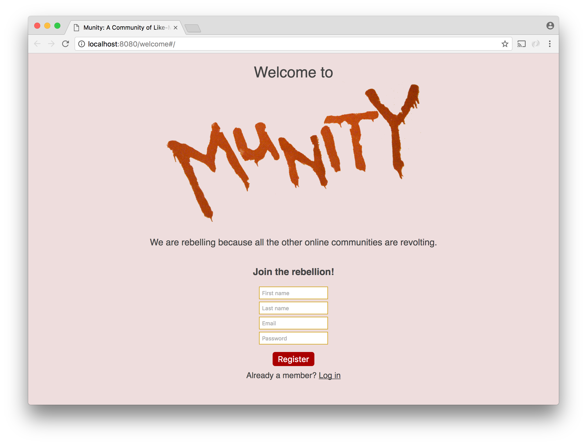
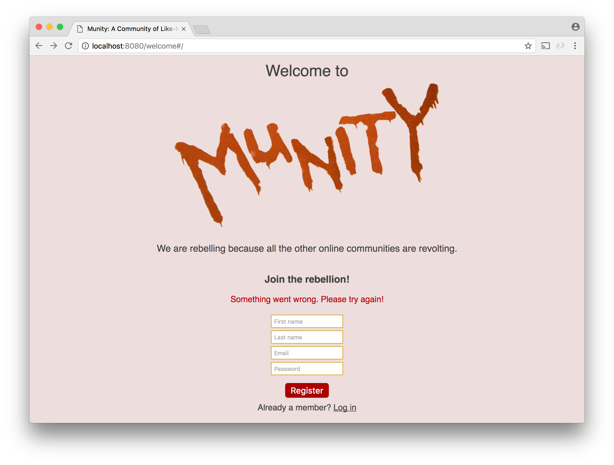
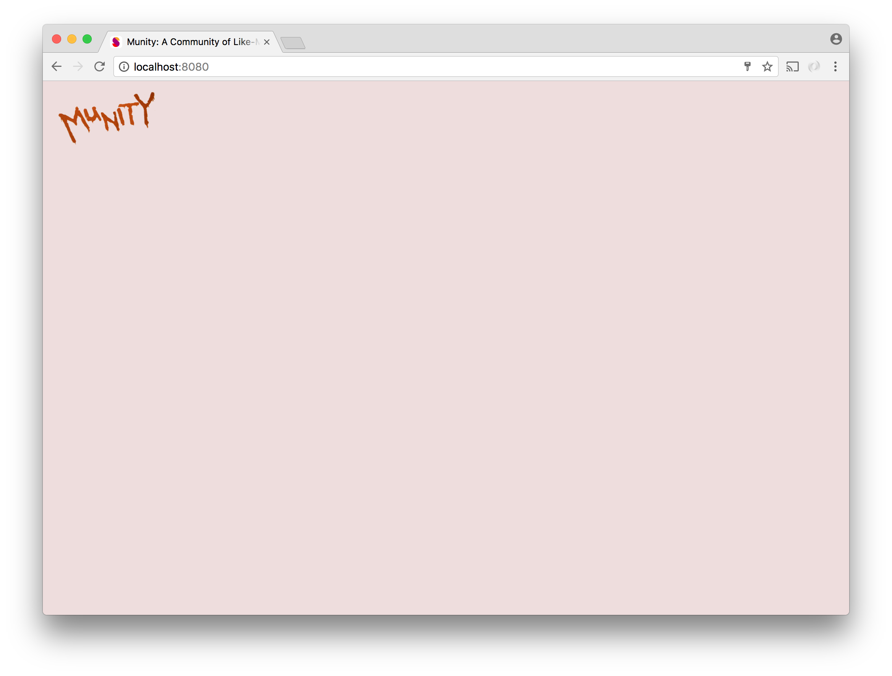

# Social Network - Part 1

For our penultimate project we will make social network on which users can sign up, say a little about themselves, and become friends with other users. This will be a single-page application made with [React](https://facebook.github.io/react/docs/hello-world.html).

Everything you will need to install is listed in the `package.json` in the repo. All you need do, as far as installation goes, is type `npm install`.

Prior to running the app, create a directory named `public`. That's where Webpack (the tool we will use to compile and package our Javascript) will place `bundle.js`, the single javascript file the site will need. You will probably also want to use `public` as a static directory and place your css and images in it.

Webpack will start with `src/start.js`. Any js file that `start.js` imports from  (as well as the files that those files import from) will be included in the bundle. The js files you create and import should be placed in the `src` directory.

There is already an `index.html` file in the project, and it is served in response to `GET` requests to `/`. This is the only HTML file this project will require.

## Registration

The first feature we want to add is registration. When logged-out users arrive at the site, they should be redirected to a `/welcome` route that serves the same HTML file as `/` and it should show a UI that looks something like this:

The page should show:

1. The social network's identity in a large, splash-like display.
2. A form with the following fields:
   * First name
   * Last name
   * Email
   * Password
3. A button to submit the registration
4. A temporarily dead link to the log in form (which we will make in Part 2)

Two React components are required to create this display.

1. A component called `Registration` that displays  the registration form itself.
2. A component called `Welcome` that renders `Registration` as  well as the surrounding UI

We want the form to be its own component so that we have the option of placing it in other contexts. Making it its own component will also make it easier to toggle to the log in form in Part 2.

`Registration` needs to be a [stateful component](https://facebook.github.io/react/docs/state-and-lifecycle.html). That is, it should be created using `class` since it needs to have a `state` property that is updated in response to changes. For example, if the ajax response to the `POST` triggered by clicking on the button indicates that something went wrong, an error message should be rendered.

After a successful registration, the user should be redirected to `/`. For now, the page should just display a small logo in the upper left corner of the screen.

A single component called `Logo` that renders the logo is all this page requires for now.

Since both `/welcome` and `/` serve the same page, you may be wondering how to determine whether the user is logged in or not so you can know what to display. You can do this by checking the`location.pathname` property in `start.js`. If the `pathname` is  `'/welcome'`, pass the `Welcome` component to `ReactDOM.render`. Otherwise, pass `logo`. This requires that the `/welcome` route redirect logged-in users to `/` and the `/` route redirects users to `/welcome`.

Note that React does not come with a built-in ajax library. We will use the [axios](https://github.com/mzabriskie/axios), a promise-based ajax library.