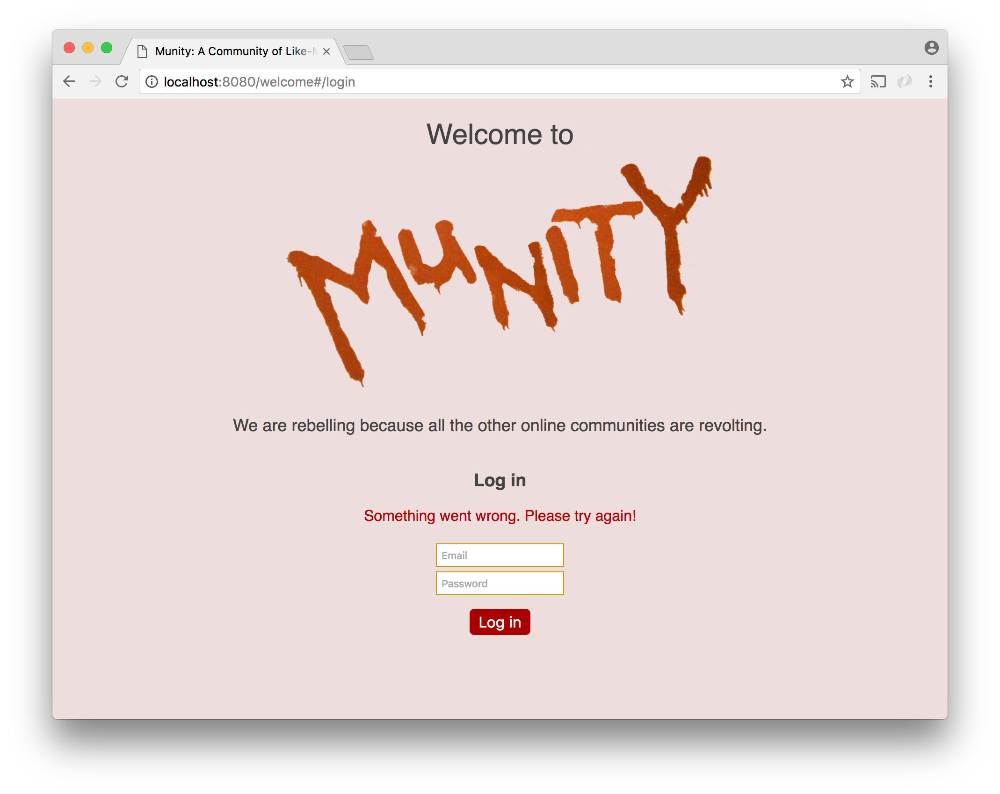

# Social Network - Part 2

With registration in place, the logical next step is to add log in functionality.


A new component called `Login` is required for this form. This component should work much like `Registration`. It should submit user input via ajax and redirect upon success. It should also display a message if an error occurs.



The real challenge here is swapping out the `Registration` component for the `Login` component when the user clicks a link. We will accomplish this using [React Router](https://reacttraining.com/react-router/).

## React Router

React Router lets you specify in JSX what components should display when specific urls are navigated to. React Router works with both url fragments and the [browser history api](https://developer.mozilla.org/en-US/docs/Web/API/History_API). For this part of the project we will use url fragments (hashes).

Consider the following example:

```js
import React from 'react';
import ReactDOM from 'react-dom';
import { Router, Route, Link, IndexRoute, hashHistory } from 'react-router';
import { Welcome, Registration, Login } from './welcome';


const router = (
    <Router history={hashHistory}>
        <Route path="/" component={Welcome}>
            <Route path="/login" component={Login} />
            <IndexRoute component={Registration} />
  	</Route>
    </Router>
);

ReactDOM.render(router, document.querySelector('main'));
```

 

The `Router` element simply sets up the routing functionality and has no visual consequences. The `history` prop tells the router to use url hashes to determine what components to render.

`Route` elements map components to paths. The first `Route` element indicates that the `Welcome` component should be rendered for the root path (`'/'`).

`Route` elements can be nested. A nested `Route` element indicates a child component that should be rendered when for a specified path.

The `IndexRoute` element indicates a child component that should be rendered when there is nothing added to the parent `Route`'s path.'

## `props.children`

Components have a special `prop` named `children` that gives them access to the components they contain. This is useful for writing components that do not have advance knowledge of what their children will be. `Welcome` is now such a component, since it will contain either `Login` or `Registration`. For `Welcome` to render the correct component, it should simply render its `props.children`.

```js
function Welcome(props) {
	return (
		<div>
      			<h1>Welcome to this site!</h1>
      			{props.children}
      		</div>
  	);
}
```

