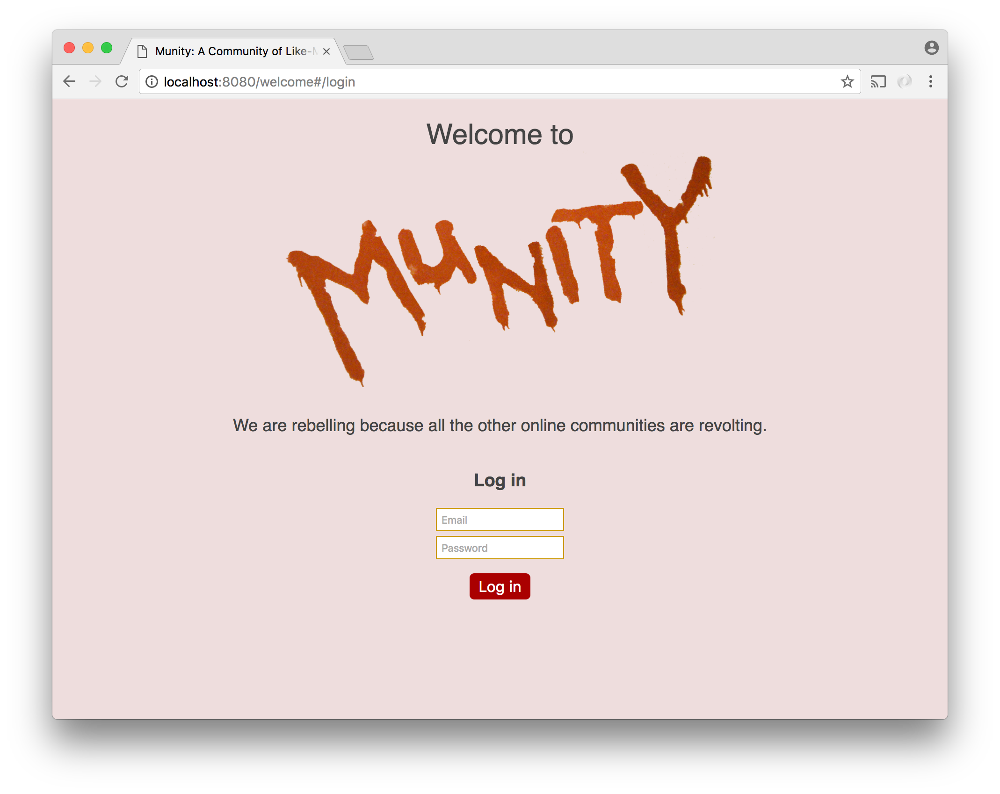

# Social Network - Part 2

With registration in place, the logical next step is to add log in functionality.



A new component called `Login` is required for this form. This component should work much like `Registration`. It should submit user input via ajax and redirect upon success. It should also display a message if an error occurs.


The real challenge here is swapping out the `Registration` component for the `Login` component when the user clicks a link. We will accomplish this using [React Router](https://reacttraining.com/react-router/).

## React Router

[React Router](https://reacttraining.com/react-router/web) lets you specify in JSX what components should display when specific urls are navigated to. React Router works with both url fragments and the [browser history api](https://developer.mozilla.org/en-US/docs/Web/API/History_API). For this part of the project we will use url fragments (hashes).

Consider the following example, in which a `Welcome` component renders a `HashRouter` with routes for showing the `Registration` and `Login` components:

```js
import React from 'react';
import { HashRouter, Route } from 'react-router-dom';
import Registration from './registration';
import Login from './login';

function Welcome() {
    return (
        <div id="welcome">
            <h1>Welcome!</h1>
            
            <HashRouter>
                <div>
                    <Route exact path="/" component={Registration} />
                    <Route path="/login" component={Login} />
                </div>
            </HashRouter>
        </div>
    );
}
```

The `render` function of this `Welcome` component will always show an `<h1>` and an `` tag. If the hash portion of the url of the page is set to either `/` or `/login`, then either the `Registration` or `Login` component will also be rendered.

The `HashRouter` element simply sets up the routing functionality and has no visual consequences. The `HashRouter` component can have only one child, which is why there is a `<div>` in it that contains our two `Route` elements.

`Route` elements map components to paths. The first `Route` element indicates that the `Registration` component should be rendered for the root path (`'/'`) and the second indicates that the `Login` component should be rendered for the path `'/login'`.

Note that the first `Route` contains an `exact` attribute. This indicates that the `Registration` component should only be rendered if the path is `'/'` _exactly_. If `exact` were not present in that `Route`, we would see _both_ the `Registration` and `Login` components when the path was `'/login'`. Because `'/login'` begins with `'/'`, React Router would view it as a match for the `Registration` component.

Whenever you create a link to one of your routes, you should import and use React Router's `Link` component.

```js
import { Link } from 'react-router-dom';
```

```js
<Link to="/login">Click here to Log in!</Link>
```
