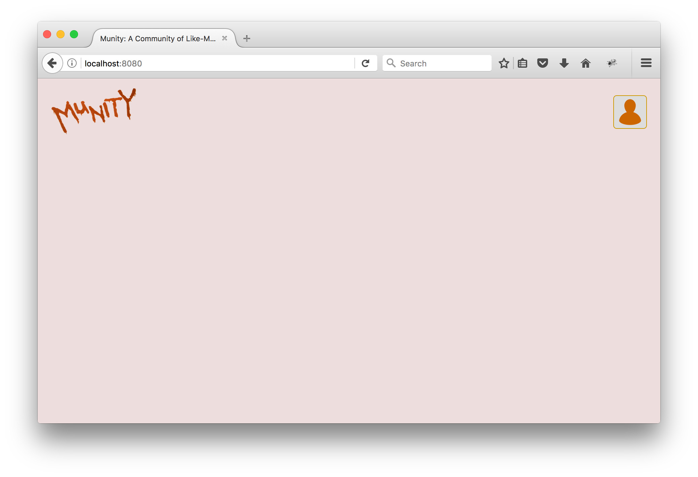
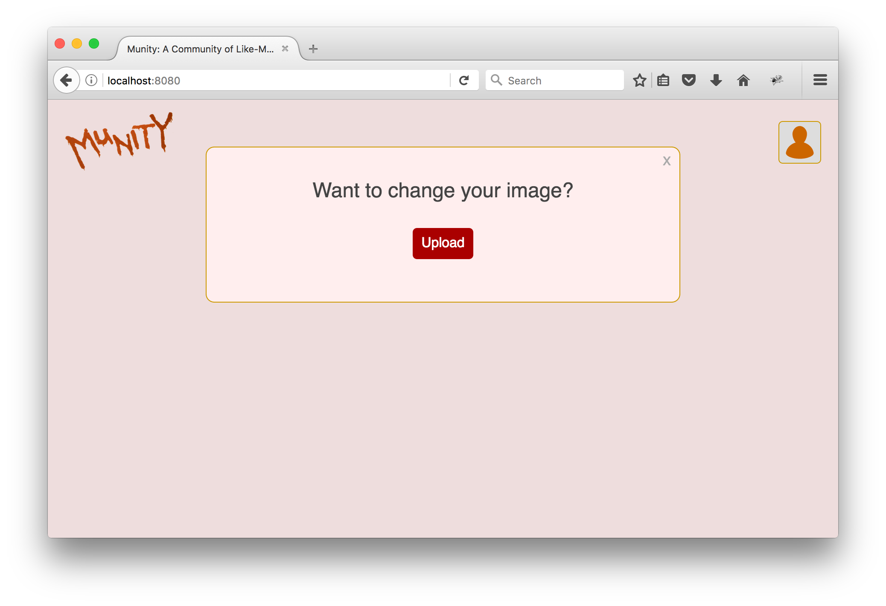

# Social Network - Part 3

Let's get going on the logged-in experience of our social network. Currently we have a single component named `Logo` rendering when users are logged in. Let's replace that with a new top-level component named `App` that will contain `Logo` and all the other components we will show.

`App` should make an ajax request to get basic data about the user such as id, first name, last name, and their profile pic url (we haven't created a way to assign profile pics yet, so no users will have any). You should create a route (`/user` would be a good path for it) that returns the logged-in user's info. After the ajax response is received, the  `App` instance should pass it to `setState`.  The `App` will then be able to pass user info to any of the components it contains. The ajax request should happen in the [`componentDidMount`](https://facebook.github.io/react/docs/react-component.html#componentdidmount) method.

## Profile Pic

In addition to `Logo`, the `App` component should contain a `ProfilePic` component and pass to it the `firstName`, `lastName`, and `profilePicUrl`  stored in its `state`. `ProfilePic` should display the image with the joined first and last name in an `alt` attribute. If there is no `profilePicUrl`, a default user image should be displayed.

# Image Upload

 Let's add a third component that is only visible after the user clicks on the profile pic.

This `ProfilePicUpload` component can display as a modal or inline in the page. Whether or not it is displayed should be determine by a property (called, for example, `showProfilePicUpload`) of the `state` of the `App` component. `ProfilePic`  should be passed a function from `App` for setting this property to `true`. 

The `ProfilePicUpload` component should be passed a function for setting the `profilePicUrl` of the `App` component's state. After a successful upload, it should set this appropriately. This should cause `ProfilePic` to automatically switch to the new image. The function for setting `profilePicUrl` should also  set `showProfilePicUpload` to `false`.

 