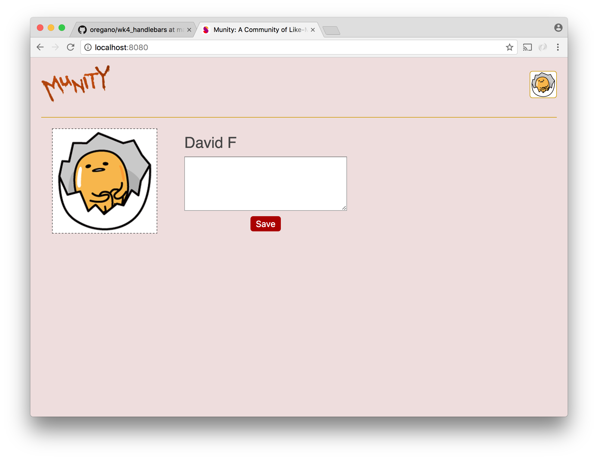
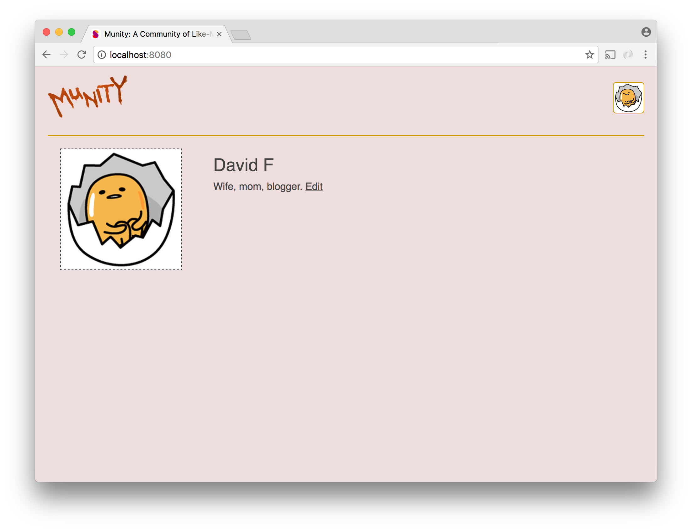

# Social Network - Part 4

Now is a good time to add routing to our logged-in experience. For this we want to use `BrowserRouter` rather than `HashRouter`. `BrowserRouter` uses the [history api](https://developer.mozilla.org/de/docs/Web/API/History) - no hashes! It's neat, but it requires us to do a couple of things to ensure that it works.

For one thing, we have to be diligent about using React Router's `Link` elements for all of our links to routes. If we used plain old `<a>` tags with `href` attributes, clicks on our links would result in our page unloading and a request for an HTML page being made to the server.

Even if we use `Link` for all of our links, it will still be possible for requests for pages to make it to the server. For example, if a user is on a route and uses the browser reload button, a GET request for the url of the page will go to the server. When our server receives such requests, it should serve the index.html file. This can be accomplished with a catch-all route, which you likely already have:

```js
app.get('*', function(req, res) {
    res.sendFile(__dirname + '/index.html');
});
```

When index.html loads in the browser, React Router will determine and automatically render the correct component(s) based on the url.

For now we are only going to need one `Route` for the path `'/'`. The component that this route will render is the `Profile` component described below.

## Profile

The `Profile` component should show the user's profile pic (use the `ProfilePic` module from part 3 but style it differently with CSS), the user's first and last name, and their bio. Initially, users will not have a bio but they have the opportunity to create it here. After they have created, they can always edit it.






Since the bio text will be in the `state` of our `App` component, neither the `Profile` component nor any child component of it will be able to change it. In order for our bio editing functionality to work, our `App` component must pass a function for changing the bio to the `Profile` component along with all the other properties that `Profile` needs.

A similar situation exists for the `ProfilePic` component that will be a child of the `Profile` component. When the user clicks on it, the `Uploader` component contained by `App` should appear. This means that the function that `App` created for making the `Uploader` appear will have to be passed from `App` to `Profile` so that `Profile` can pass it to the `ProfilePic` component it contains.

In order to pass props to `Profile`, we can use an alternative to the `component` prop in our `Route`. The `Route` component allows you to specify a `render` function to run for the route. This function should return JSX, which gives us an opportunity to pass props.

```js
<Route
    path="/"
    render={() => (
        <Profile
            id={this.state.id}
            first={this.state.first}
            last={this.state.last}
            profilePic={this.state.profilePic}
            bio={this.state.bio}
            setBio={this.setBio}
            showUploader={this.showUploader}
        />
    )}
/>
```
