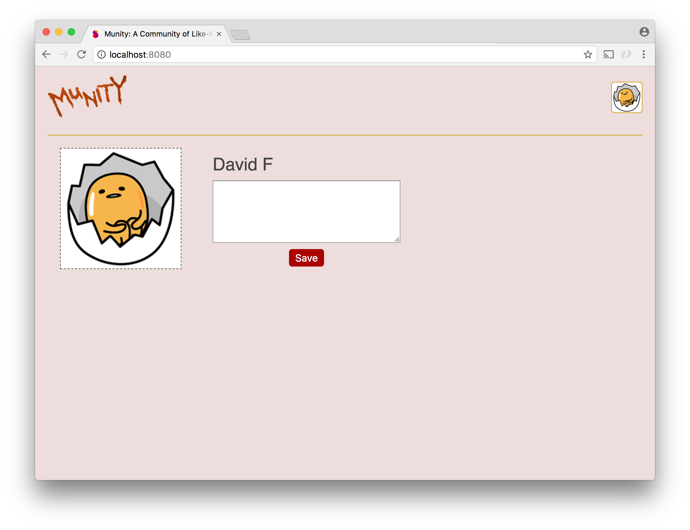

# Social Network - Part 4

For this part we want to show users all of their profile information on the screen they see when they first log in. This includes their name, their profile picture, and their bio. On this screen, users should also be able to update their profile picture and edit their bio (or add one if they haven't already).





Two new components will be required for this part: `Profile` and `BioEditor`.

## 1. `Profile`

The `Profile` component will be responsible for laying out the content we want to show: the user's name, profile picture, and bio. `Profile` will be a direct child of `App`.

The `Profile` component will itself contain two other components:

1. The existing `ProfilePic` component, which will show the user's pic in a larger size.

2. A new `BioEditor` component, which will show the user's bio if they have one and allow them to add one if they don't. Also, if the user does already have a bio, the `BioEditor` component will allow them to edit it.

It is not necessary to create a component to show the user's name. The `Profile` component can just print the name out in its render function.

## 2. `BioEditor`

The `BioEditor` component should expect to receive a prop that contains the user's current bio text. Since the bio text is coming from outside itself, the `BioEditor` component will also need to be passed a function that it can call and pass the new bio text when a new bio has been saved. This function would be much like the one that `Uploader` had to be passed so that it could  cause the `state` of `App` to be updated with the new image url when a new image was uploaded.

If the user has a bio saved, the `BioEditor` component should show that text, along with an "Edit Bio" button.

If the user's current bio text doesn't exist (it is an empty string or `undefined` or `null`), the `BioEditor` component should show an "Add Bio" button.

When the user clicks either the "Edit Bio" or the "Add Bio" buttons, the component should enter 'editing mode'. When the user is editing, a `textarea` for the user to type in should be visible along with a `Save` button. When the button is clicked, the component should make a POST request to save the new bio to the database. When the request is successful, the component should exit editing mode and call the function it was passed to update the bio.

The logic for determining what to show in the `render` function of `BioEditor` goes like this:

```
  Is the bio being edited?
          /       \
         /         \
    yes /           \ no
       /             \
      /               \
<textarea>           Is there a saved bio already?
"Save" button                 /       \
                             /         \
                        yes /           \ no
                           /             \
                          /               \
            Current bio text             "Add" button
            "Edit" button
```

`BioEditor` will require a property in its `state` for keeping track of whether it is in editing mode. It will also need a property to store the "draft" bio that is produced as the user types in the text area. This can be set initially to the current bio text that the component receives as a prop.

## Passing props

Since information that `Profile` needs to show is held in the `state` of `App`, `App` will have to pass this information as props to `Profile`. In order for `Profile` to show the user's name, `App` will have to pass the first and last name it has in its state as props to `Profile`.

Similarly, both `BioEditor` and the second instance of `ProfilePic` will have to be passed data and functions that live in `App`. However, neither of these components are children of `App`, which complicates things considerably.

Perhaps the most obvious solution is to have `App` pass to `Profile` everything that `BioEditor` and the second `ProfilePic` need and then have `Profile` pass those props to its children.

```js
<Profile
    id={this.state.id}
    first={this.state.first}
    last={this.state.last}
    image={this.state.image}
    onClick={this.showUploader}
    bio={this.state.bio}
    setBio={this.setBio}
/>
```

A less obvious approach would be to pass components to `Profile` and let `Profile` render them in the correct spot.

```js
<Profile
    first={this.state.first}
    last={this.state.last}
    profilePic={
        <ProfilePic
            id={this.state.id}
            first={this.state.first}
            last={this.state.last}
            image={this.state.image}
            onClick={this.showUploader}
        />
    }
    bioEditor={
        <BioEditor
            bio={this.state.bio}
            setBio={this.setBio}
        />
    }
/>
```

There are other solutions to this problem of passing props to components deep in the tree that we shall discuss later.
