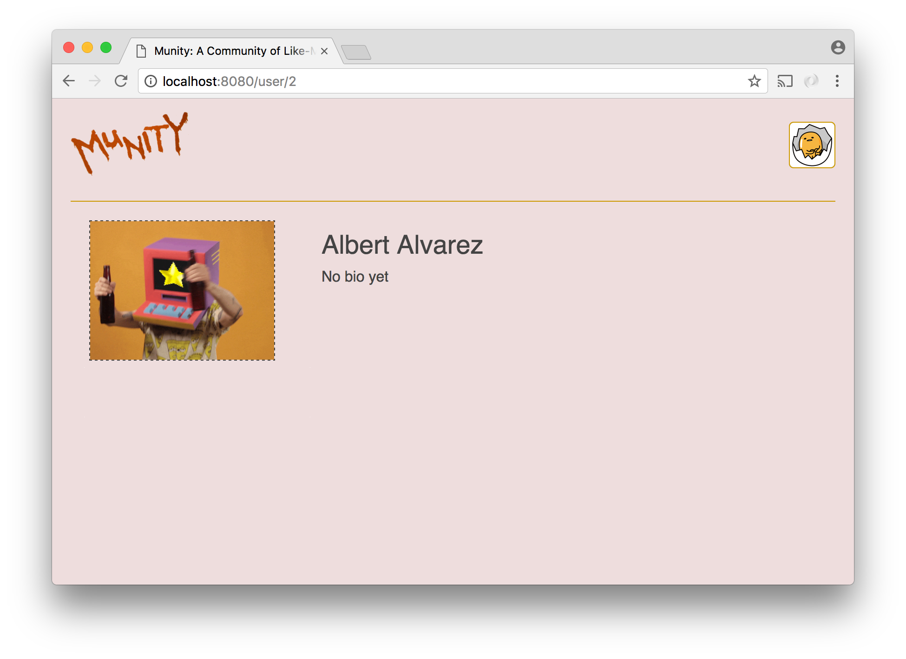

# Social Network - Part 5

In this part we will add routing to the logged in experience so that the `Profile` component can be swapped out for a different component when the url changes. The first component we want to be able to replace `Profile` with will be a new one called `OtherProfile`. It will show the profile information of users other than the logged in user. Because the information it shows does not belong to the person who views it, it will not provide any way to edit anything.



## `BrowserRouter`
`BrowserRouter` is an alternative to `HashRouter` that works similarly except that it bases its matching on the path portion of the url rather than the hash. It does this using the [history API](https://developer.mozilla.org/en-US/docs/Web/API/History_API#Adding_and_modifying_history_entries), which allows it to add browser history entries when users click on links to defined routes and to detect when users navigate to routes by using the browser's back button.

Using `BrowserRouter` requires diligence about using React Router's `Link` component for all links to routes. `Link` creates `<a>` elements that have click handlers attached to them that override the default link behavior. The `href` of the link is not automatically navigated to in response to a click. Instead, the url is updated and the component that corresponds to the new url is rendered. If plain `<a>` tags were used instead of the `Link` component, clicks on links would result in the page unloading and a request for an HTML page being made to the server, breaking the single page app experience.

It will still be possible for requests for pages to make it to the server. For example, the server will receive a request if a user navigates by typing a url into the browser's location bar rather than by clicking a link. For this reason, it is necessary to have a catch-all (`'*'`) route that serves index.html. When index.html loads, React Router will determine and automatically render the correct component(s) based on the url.

For the catch-all route to serve its purpose, it is necessary that in your Express app there are no routes that match any of the paths you specify for your `Route` components in your React app. If, for example, you set the `path` prop of a `Route` component to `'/user/:id'`, there should be no `'/user/:id'` route on the server. You might use `'/api/user/:id'` or `'/user/:id.json'` for your server route instead.

In our `BrowserRouter` in `App` we will have two `Route` components to start. One will be for `Profile` and the other for the new `OtherProfile`. In the case of `Profile`, the `Route` component will look a little different than the `Route` components did in the `HashRouter` contained by the `Welcome` component. Because `Profile` must be passed props, we cannot use the `component` prop to specify the component to use. Instead, we must use the `render` prop and set it to a function that renders the `Profile`.

```js
<BrowserRouter>
    <div>
        <Route
            exact
            path="/"
            render={() => (
                <Profile
                    id={this.state.id}
                    first={this.state.first}
                    last={this.state.last}
                    image={this.state.image}
                    onClick={this.showUploader}
                    bio={this.state.bio}
                    setBio={this.setBio}
                />
            )}
        />
        <Route path="/user/:id" component={OtherProfile} />
    </div>
</BrowserRouter>
```

## `OtherProfile`

The responsibility of the `OtherProfile` component is to show the profile information of a user other than the logged in user. Because it is visually similar to `Profile`, there is a temptation to just alter `Profile` to support showing other profiles and not create `OtherProfile` at all. However, there are significant differences between the two use cases that make it more effortful to have one component instead of two. For example, when `OtherProfile` mounts, it needs to make an ajax request to get profile information. When `Profile` mounts it does not have to do this because it is passed all the information it needs to show. Additionally, `Profile` allows editing of profile information while `OtherProfile` does not. If you had just one component for both jobs, it would need to have several conditionals to handle these different situations, making it less focused and harder to understand.

When `OtherProfile` mounts, it needs to make a request to retrieve the relevant profile information. This means it must know the id of the user whose profile it is to display. This id will come from the url. If you set the `path` of the `Route` that renders `OtherProfile` to a value such as `'/user/:id'`, your component will automatically receive a prop named `match` that contains information about how React Router interpreted the url. The `match` object will have a property named `params`, an object that has properties for each segment of the path you marked with a colon. Thus you will be able to access the id you need to put into your ajax request as `this.props.match.params.id`.

Once the profile data is retrieved, it should be added to the component's state so that the `render` function can run again and print out the values. Since editing should be disallowed, you should not use the `BioEditor` component to show the user's bio. It is sufficient to simply plop the bio text into a `<p>` element if it exists. There is also no need to use the `ProfilePic` component. You can just add an `` element with the correct `src`.

There are a couple of other small things regarding `OtherProfile` to be aware of:

1. Unless you take steps to prevent it, it will be possible for users to view their own profiles by navigating to the url for it. It is not straightforward to disallow this because `OtherProfile` doesn't know the logged in user's id and, at the time `OtherProfile` mounts, the `App` component may not know it yet either. The best way to disallow it would be to let the ajax request that `OtherProfile` makes get to the server and have the server send back some specific message indicating that the id that was passed to it is the same as the id of the logged in user. If the server responds in this way, you can then redirect the user away using the `history` prop that React Router will automatically pass to your component:

    ```js
    this.props.history.push('/');
    ```
2. A problem you definitely won't have now but may have in the future is that React Router will reuse components if it can. If a user navigates from `/user/1` to `/user/2` by clicking a link on `/user/1`, React Router will not instantiate a new `OtherProfile`. Instead, the existing component will receive new props. Fortunately, there is [a very simple way](https://reactjs.org/blog/2018/06/07/you-probably-dont-need-derived-state.html#recommendation-fully-uncontrolled-component-with-a-key) to force a new component to be rendered. If you give your component a unique `key` attribute, you will force React to create a whole new instance of the component when the key changes.
    ```js
    <Route
        path="/user/:id"
        render={props => (
            <OtheProfile
                key={props.match.url}
                match={props.match}
                history={props.history}
            />
        )}
    />
    ```
