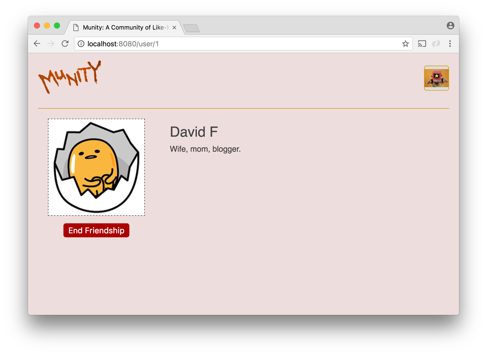

# Social Network - Part 6

The focus of Part 6 is a single component, `FriendButton`, that appears only as a child of the `OtherProfile` component created in Part 5. The purpose of `FriendButton` is to allow users to friend and unfriend other users.

When a user views the profile of another user with whom she has no friendship or pending friend request, `FriendButton` should give her the ability to send that user a friend request.


After the user clicks this button and makes a friend request, a pending friend request will exist. The button should change to allow the sender to cancel this friend request.


When the recipient of a friend request views the profile of a user that has sent her a friend request that she has not yet accepted, `FriendButton` should allow her to accept the friend request.


Once a friend request has been accepted, `FriendButton` should give both parties the option to unfriend the other.



After unfriending, the button should return to being a 'Make Friend Request' button for both users.

## Database

To drive this feature, data must be stored in a way that makes it possible to answer the following questions:

1. Is there an existing friend request between a given pair of users?

2. If there is a request, has it been accepted?

3. If there is a request and it has not been accepted, who is the sender and who is the receiver?

A simple way to accomplish this would be to create a table for friend requests that has columns for the id of the sender, the id of the recipient, and a boolean indicating whether or not the request has been accepted. When one user sends another a friend request, a row would be inserted with the ids of the sender and receiver in the appropriate columns and the boolean set to false. When a user accepts a friend request, the appropriate row would be updated to set the boolean to true. When a user unfriends or cancels a pending request, the row for the request can be deleted (deleting these rows means that we will lose potentially valuable historical information, but that is probably acceptable for our purposes).

## `FriendButton`

The `FriendButton` component will have to be passed a prop containing the id of the user whose profile it is appearing on so that it can make an ajax request to retrieve the information it needs to render correctly when it mounts. That is, `OtherProfile` must pass it the id that is in the url.

In addition to the GET request it makes when it mounts, `FriendButton` will have to make POST requests whenever it is clicked. The POST request it makes must be determined by the current state.

The logic for determining what the button should say and what should happen when it is clicked goes likes this:

```
Is there an existing request between the profile viewer and profile owner?
                            /           \
                           /             \
                       no /               \ yes
                         /                 \
                        /                   \
       "Send Friend Request"              Is the request accepted?
                                                /           \
                                               /             \
                                           no /               \ yes
                                             /                 \
                                            /                   \
            Is the profile owner the recipient?              "Unfriend"
                       /           \
                      /             \
                  no /               \ yes
                    /                 \
                   /                   \
"Accept Friend Request"             "Cancel Friend Request"


profile viewer = the logged-in user, the one who is viewing the profile
profile owner = the user whose profile is being viewed, the one whose id is in the url
```                            

This determination will have to be made every time the component mounts and every time the user causes a state change by clicking the button. It is possible to locate the bulk of the code for making this determination on the server by having the GET and POST routes respond with a flag indicating what the button should say and do. Alternatively, the server can respond to the GET and POST routes with the current information from the database, leaving it to the `FriendButton` itself to do all of the logic.

## Express Routes

One GET route and at least one POST route will be required.

The GET route should send back to the client the information that is required for the `FriendButton` to render when it mounts.

The POST route(s) should send back a similar response after performing the appropriate `INSERT`, `UPDATE`, or `DELETE` query.

If you have just one POST route, you must include in the request enough information for the route to determine what query to do. If instead you want to have one route per query, you would only need to have three routes since the action for canceling a request and ending a friendship is the same.

## Testing

One of the hardest things about this part is confirming that the button is working correctly. Manual testing requires logging in as different users either sequentially or with multiple browsers at the same time. The site doesn't look terribly different for different users so it can get quite confusing.

Writing tests with Jest and Enzyme can be very helpful here. In fact, this may be a good situation to try out a test-driven approach in which you write the tests for the component first and then write the code for the component to make the tests pass.
