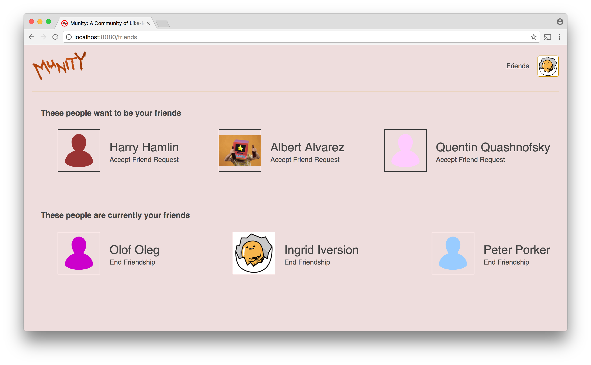

# Social Network - Part 7

Now we want to add a new screen that allows users to see all of the users who have sent them friend requests that they have not yet accepted as well as the full list of all their friends. A link to this screen should always be visible next to the user's profile pic. The path for this screen should be `/friends`.

The friends and potential friends shown in these two lists should link to the appropriate profiles. Displayed with each friend should be a link or a button that allows the user to end the friendship. Displayed with each requester should be a link or button for accepting the request.

We want to use [Redux](../redux) for this feature as well as all other features we add henceforward. You will have to modify your initialization code (which probably still resides in `start.js`) to support this. You will have to

* Create a Redux store and apply the `redux-promise` middleware
* Wrap your router in the `Provider` component exported by `react-redux` and pass the store to it as a prop

The component you use for the `/friends` route should be created using the `connect` function from `react-redux`. The component you pass to the function that `connect` returns will have to cause the fetching of the friends and requesters to happen when it mounts, which means that it will have to be created with `class` so you can use the `componentDidMount` method.

The fetching of the friends and requesters should be caused by the dispatching of an action. It will also be necessary for actions to be dispatched for accepting friend requests and ending friendships. All of these require server requests to be made, so the action creators should return promises that resolve with actions.

When requests are accepted and friendships ended, your reducer should change the state object to one that has the new list(s) of users. This should cause re-rendering with either new users appearing in the list of friends or old friends disappearing from it.

**Bonus Feature**: Add to each requester you display a link or button for rejecting the friend request.

## A note about keys

For this part we will be showing two lists of items. When displaying lists of elements constructed from arrays, it helps React render efficiently if you give each element a special attribute named `key` and set each to a unique value. In our present situation, you could use the id of the user or the id of the friend request as the `key`. For more information about keys, see the [_Lists and Keys_](https://reactjs.org/docs/lists-and-keys.html) article from the guide at reactjs.org. 
