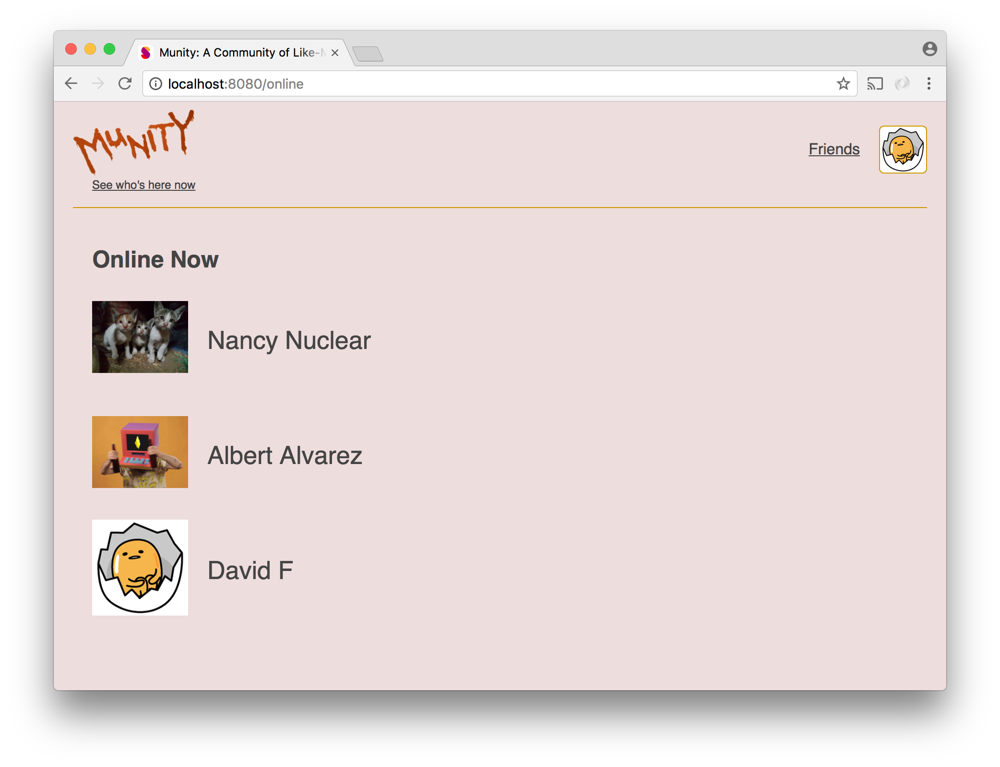

# Social Network - Part 8

Wouldn't be great to know who is using this site right now? It sure would, so let's add a new screen that tells us.



It's actually not too difficult to build a list of logged in users. Every time a logged in user makes a request, you could push an object representing that user to an array after confirming that that user is not already in the list. The situation would be more complicated if your code was running on multiple servers and/or if you were using [`cluster`](../wk9_cluster), but a simple array in memory would work for us. The problem that arises is this: how do you keep the list updated as users stop using the site? How do you know when a user has left?

We can use [socket.io](../socket.io) to figure it out. If we establish a connection with socket.io when the logged in experience loads, we can use the `'disconnect'` event to detect on the server when the user closes the browser or otherwise unloads the site. When that happens, we can remove the user from our list.

Adding a user to the list becomes a little more complicated now. Each item in our list of online users needs to include not just the user's id but also the id of their socket. The id of the socket is necessary so we can know which user left when the disconnect event occurs.

We can use the socket object passed to our `'connection'` event handler on our server to determine both the id of the socket and the id of the user. The socket will have a property named `id`, which is the id of the socket itself. To get the id of the user, we'll have to do a little setup.

socket.io adds to socket objects a `request` property. This property holds the request object for the HTTP request that initiated the WebSocket connection. The session cookie will be present in this request. However, the cookie-session middleware will not automatically run on it. To ensure that this request has a `session` property, we need to tell socket.io to run the cookie-session middleware on it:

```js
const cookieSession = require('cookie-session');
const cookieSessionMiddleware = cookieSession({
    secret: `I'm always angry.`,
    maxAge: 1000 * 60 * 60 * 24 * 90
});

app.use(cookieSessionMiddleware);
io.use(function(socket, next) {
    cookieSessionMiddleware(socket.request, socket.request.res, next);
});
```
With this code in place, we can expect `socket.request.session` to be present when a user connects.

```js

io.on('connection', function(socket) {
    if (!socket.request.session || !socket.request.session.user) {
        return socket.disconnect(true);
    }

    const userId = socket.request.session.user.id;
});
```

Once you have both the id of the socket and the id of the user, you can make each of them properties of an object and put that object in an array. Alternatively, you could have an object that uses socket ids as keys and user ids as values.

Keep in mind that it is possible for a single user to appear in your list more than once. If a user has the site open in two tabs, there will be two sockets associated with that user. For this reason, it is important to only remove the item from the list that has the matching socket id when `'disconnect'` event occurs. If a user who has the site open in two tabs closes one of them, she should remain in the list of online users.

When a user is added to the list of online users, the server should send a message to that user with the list of all online users as the payload. Let's call this event `'onlineUsers'`.

Also when a user is added to the list of online users, the server should send a message to _all_ online users with information about the user who just came online as the payload, allowing all clients to keep their list of online users updated. Let's call this event `'userJoined'`.

When a user disconnects, after removing the user with the id of the socket that disconnected from the list, you should determine if that user is no longer in your list at all. If the user is gone, the server should send a message to all connected clients with the id of the disconnected user in the payload so that they can update their lists of online users accordingly. Let's call this event `'userLeft'`.

In your client code, you will have to listen for the `'onlineUsers'`, `'userJoined'`, and `'userLeft'` events and handle them by dispatching corresponding actions. The actions should result in an up-to-date list of online users being present in your global state object at all times. Your component for displaying the list of online users should be passed the list as a prop by a container component created with the `connect` function exported by `react-redux`.

A couple of other points:

* Although it is possible for users to appear multiple time in the list you maintain on the server, it is important that they appear only once in the list you display. For this and other reasons, it is important that on the client you make sure that you have only one socket per open tab and that you attach listeners for the `'onlineUsers'`, `'userJoined'`, and `'userLeft'` events no more than once per socket.

* Unless you keep full information about everybody in the list of users you maintain on the server, it will be necessary to do a database query prior to to emitting the `'onlineUsers'` event. For this query you will have a list of user ids you want to match rather than just one. You can accomplish this using the [`ANY`](https://www.postgresql.org/docs/9.1/static/functions-comparisons.html) function.

  ```js
  function getUsersByIds(arrayOfIds) {
      const query = `SELECT * FROM users WHERE id = ANY($1)`;
      return db.query(query, [arrayOfIds]);
  }
  ```
