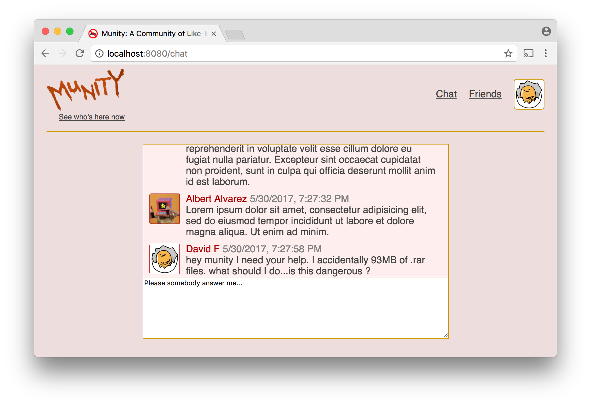

# Social Network - Part 9

Now let's use [socket.io](../socket.io) to create a community-wide chat room. This feature will use socket.io and Redux similarly to the [list of online users](../social_network8).

Clients will now emit a `'chatMessage'` event that has a textual message in its payload. When the server receives this event, it should broadcast a `'chatMessage'` event to all of the connected sockets. The payload for this event should include the message the user sent as well as the user's id, first name, last name, and profile pic. The server should also store the message in an array or in a database table. If you choose the array option, you should limit the array's size to ten.

When you add a user to the list of online users you are maintaining on the server, you should send to that user an event called `'chatMessages'` containing the ten most recent chat messages in its payload. When the client receives this list, it should dispatch an action to cause it to be stored in the state. Similarly, when the client receives a `'chatMessage'` event, it should dispatch an action that causes the chat messages in the state to be replaced with a new list that contains the new message.

You'll need to create a new child route (`/chat` or suchlike) of the main route that has `App` as its component. The component you use for this route should be created using `connect`, since it will have to pass to the presentational component it contains the chat messages stored in the state object as a prop. This presentational component should display the messages that have been received as well as a `<textarea>` in which the user can type a new message. When the user hits the `enter` key in this `textarea`, a `'chatMessage'` event should be emitted. This means that the component will need access either to the socket you created in [Part 8](../social_network8) or to a function that can call the `emit` method of that socket.



## Scrolling

In most chat UIs a newly received message will be added to the bottom of the display area and automatic scrolling will bring it into view. CSS does not provide a way to implement this behavior but Javascript does. With Javascript you can set the `scrollTop` of the element every time you add a new message. However, to do this you need access to the element and normally in React we do not act directly on HTML elements. Fortunately, React does provide a way to gain access to specific DOM elements for rare occasions such as this when it becomes necessary. In your JSX you can give an element a special attribute named [`ref`](https://facebook.github.io/react/docs/refs-and-the-dom.html) and assign a function as its value. This function will be called when the element is inserted into the DOM and it will be passed a reference to the element.

```js
<div id="chat-messages" ref={elem => this.elem = elem}>
/* messages go here */
</div>
```

If you do this, you will be able to access the element as `this.elem` in your component's methods. The method in which you will want to set the element's `scrollTop` property is [`componentDidUpdate`](https://facebook.github.io/react/docs/react-component.html#componentdidupdate).
