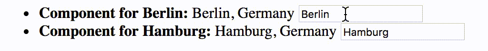
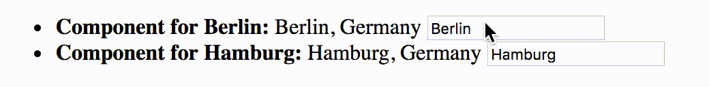

# Vue.js Components

[Components](https://vuejs.org/v2/guide/components.html) are a way to write modular, reusable code for your Vue.js application. Components can be thought of as custom HTML elements that can be used by your main `Vue` instance and/or by other components. They can also be thought of as mini- or sub- `Vue` instances.

To create a component, you can register it globally with the `component` method of the `Vue` constructor.

```js
Vue.component('some-component', {
    /* data, methods, etc. go here */
});
```

The first argument is a string to use as the name of the component. You use the name as a tag name in your HTML to render the component.

```HTML
<some-component></some-component>
```

It is customary for the name to be all lowercase and have hyphens separating words (kebab case).

The second argument is a configuration object of the sort you also pass to the `Vue` constructor. Almost everything you can pass to the `Vue` constructor you can also pass to `Vue.component`. Two important exceptions are `el` and `data`.

You don't pass an `el` to `Vue.component` because they get rendered in place where their tag is encountered. Rather than an `el`, you specify a template to use for the component's DOM subtree.

You do pass `data` when appropriate but it takes a different form than the `data` you pass to the `Vue` constructor. Rather than being an object, the `data` you pass to `Vue.component` must be a function that returns an object.

```js
Vue.component('some-component', {
    data: function() {
        return {
            heading: 'Some Component'
        };
    }
});
```

This is necessary because components can be used many times and we want each one to have its own data object. See [here](https://vuejs.org/v2/guide/components.html#data-Must-Be-a-Function) for an example of what happens if you use a shared object for a component's data.

### Templates

There are several ways you can specify a template for a component.

One way is to put the content of the template inside the tag for the component itself. For this to work, you need to add an attribute named `inline-template`
to the tag.

```html
<some-component inline-template>
    <div>
        <h1>{{heading}}</h1>
        <p>This is a component</p>
    </div>
</some-component>
```

This approach is of limited value because you very often want to use components repeatedly and it would be extremely annoying to have to rewrite the template every time.

Another option is to use a `<script>` tag for your template, as we did with our [client-side Handlebars templates](../wk4_handlebars).

```js
Vue.component('some-component', {
    data: function() {
        return {
            heading: 'Some Component'
        };
    },
    template: '#some-template'
});
```

```html
<script id="some-template" type="x-template">
<div>
    <h1>{{ heading }}</h1>
    <p>This is a component!!!</p>
</div>
</script>
```

```HTML
<some-component></some-component>
```

You can also set the `template` property to a string containing your template directly. This only works well for short (one-line) templates. Longer templates become hard to work with.

```js
Vue.component('some-component', {
    data: function() {
        return {
            heading: 'Some Component'
        };
    },
    template: '<h1>{{heading}}</h1>'
});
```

Note that, in all of the template examples above, only one root element is contained in the template with all other elements contained within it. This is a requirement for Vue templates.

### `props`

Data can be passed to components as custom attributes. This data is referred to as `props` in Vue.js terminology. In order to pass a prop to a component, you must declare the name for it by listing it in an array named `props`.

```js
Vue.component('individual-city', {
    props: ['id', 'name', 'country'],
    template: '<span>{{name}}, {{country}}</span>'
});

var app = new Vue({
    el: '#main',
    data: {
        cities: [
            {
                id: 1,
                name: 'Berlin',
                country: 'Germany'
            },
            {
                id: 2,
                name: 'Hamburg',
                country: 'Germany'
            }
        ]
    }
});
```

```HTML
<div id="main">
    <ul>
        <li v-for="city in cities">
            <individual-city v-bind:id="city.id" v-bind:name="city.name" v-bind:country="city.country"></individual-city>
        </li>
    </ul>
</div>
```


When you pass primitive values as props to a component, the component stores the props as properties of itself, just as it does the items passed in `data`. These properties are distinct from the properties of the parent that passed the props to the component. When the props of the component changes, the properties of the parent do not.

```js
Vue.component('individual-city', {
    props: ['id', 'name', 'country'],
    template: '<span>{{name}}, {{country}} <input v-model="name"></span>'
});
```

```HTML
<div id="main">
    <ul>
        <li v-for="city in cities">
            <strong>Component for {{city.name}}:</strong>
            <individual-city v-bind:id="city.id" v-bind:name="city.name" v-bind:country="city.country"></individual-city>
        </li>
    </ul>
</div>
```



In this example, using the form field changes the value of the `name` property of the component. However, the `name` property of the city object in the array that belongs to the parent of the component does not change.

This inability of a component to alter its parent is by design. By ensuring that data flows in one direction - from the parent to the component - Vue.js eliminates a lot of potential confusion.

If you want to have a component affect it's parent, you can have the component emit events that the parent listens for. You use the `$emit` method of the component to do this.

```js
Vue.component('individual-city', {
    props: ['id', 'name', 'country'],
    methods: {
        changed: function() {
            this.$emit('changed', this.id, this.name);
        }
    },
    template:
        '<span>{{name}}, {{country}} <input v-model="name" v-on:input="changed"></span>'
});

var app = new Vue({
    el: '#main',
    data: {
        cities: [
            {
                id: 1,
                name: 'Berlin',
                country: 'Germany'
            },
            {
                id: 2,
                name: 'Hamburg',
                country: 'Germany'
            }
        ]
    },
    methods: {
        updateCityName: function(id, name) {
            for (var i = 0; i < this.cities.length; i++) {
                if (this.cities[i].id == id) {
                    this.cities[i].name = name;
                    return;
                }
            }
        }
    }
});
```

```HTML
<div id="main">
    <ul>
        <li v-for="city in cities">
            <strong>Component for {{city.name}}:</strong>
            <individual-city v-bind:id="city.id"
                  v-bind:name="city.name"
                  v-bind:country="city.country"
                  v-on:changed="updateCityName"></individual-city>
        </li>
    </ul>
</div>
```



If you pass an object or array to a component as a prop, changes the component makes to the object or array will affect the parent. You should take care that your components do not mutate any objects or arrays passed to them. If it is necessary for a component to mutate an object or array passed to it, you should pass a clone of the object or array.
