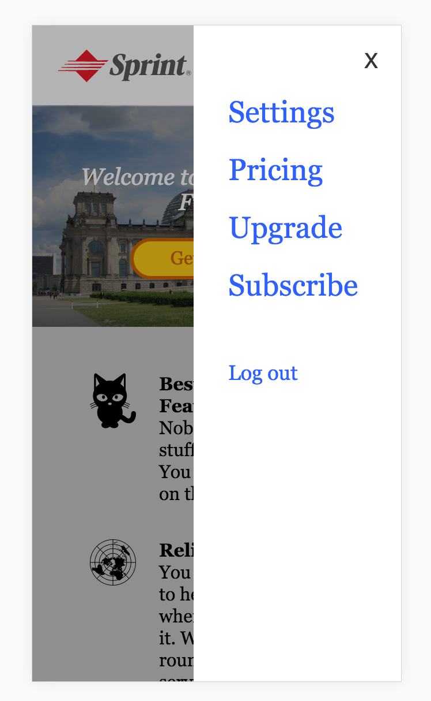

Let's take <a href="../wk1_html_css_lab">the page we worked on last week</a> and add to it the menu that appears when users click on the hamburger icon on the upper right. After the menu appears, clicks outside of it should make it disappear (clicks on the X in the upper right corner of the menu should also make it disappear).

**Bonus**: Use [CSS transitions](https://developer.mozilla.org/en-US/docs/Web/CSS/CSS_Transitions/Using_CSS_transitions) to make the white menu slide in from the right when the user clicks the hamburger button. 
