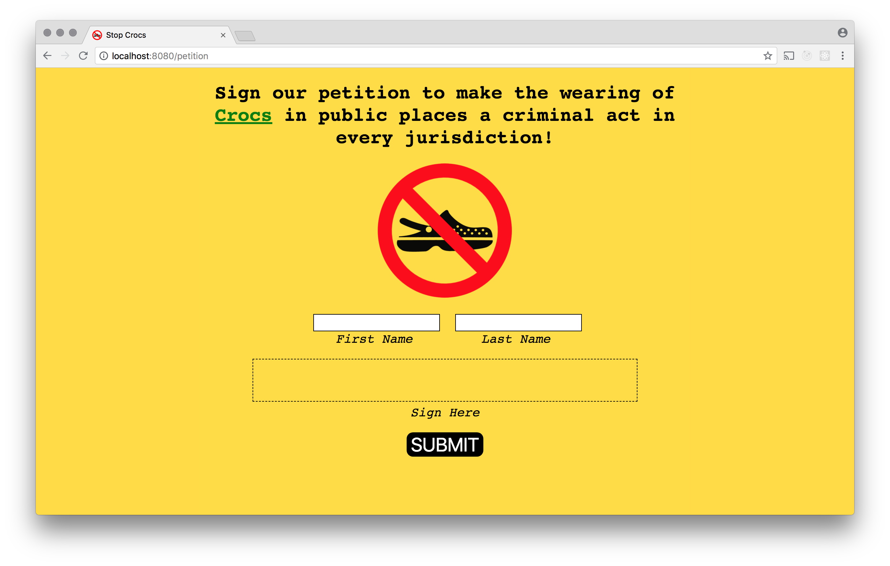
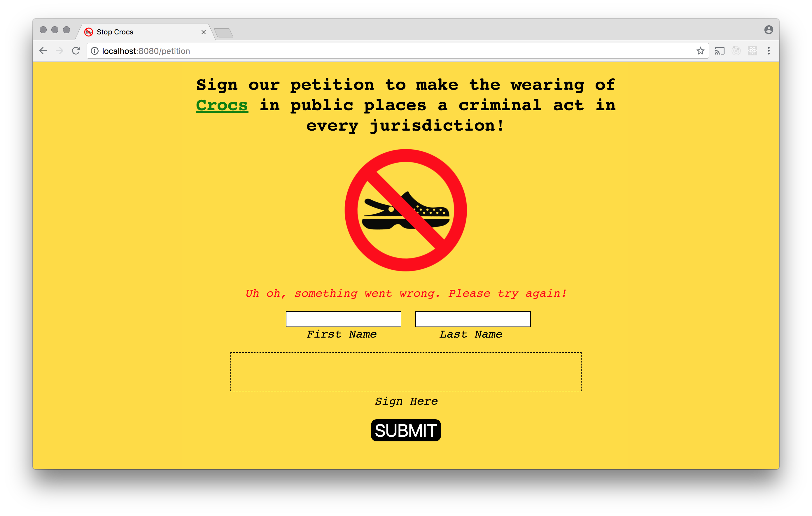
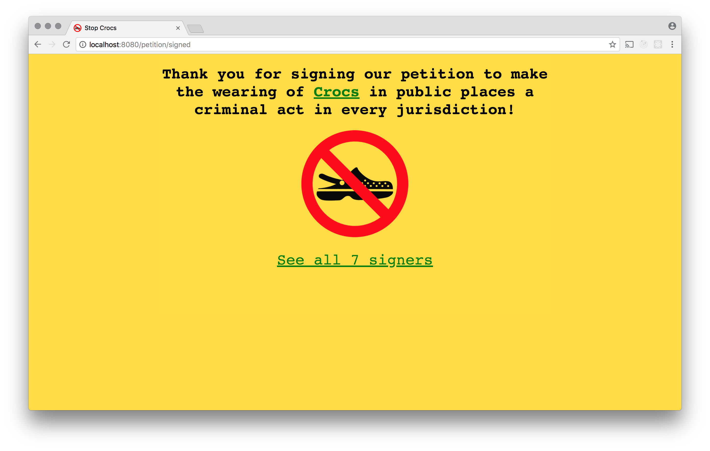
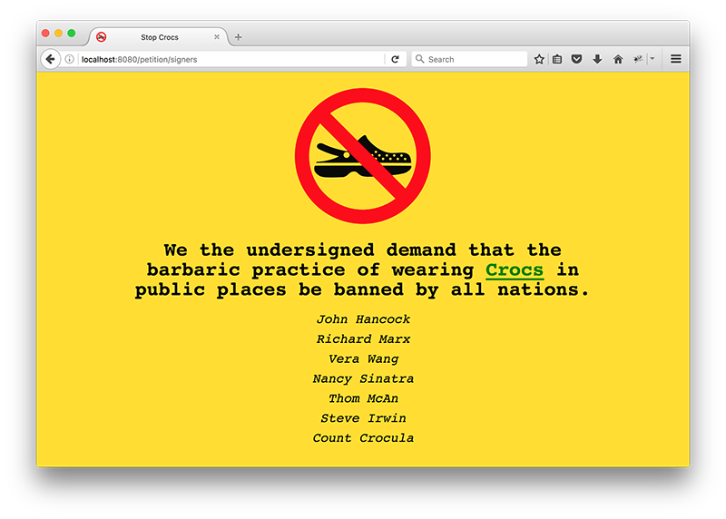

# Petition

The idea behind this project is to create an online petition that visitors can sign to make their voice heard on an issue of your choosing.



The petition can be about something ridiculous, as in the example presented above, or a matter of great seriousness. Since we are going to be working on this project for considerable amount of time, it would be best if you chose a topic that interests you. Keep in mind that we will be presenting our petitions in class as well as publishing them on the web, so you should not choose a topic that would offend or alienate your colleagues or others you may want to impress with your work.

## Requirements for Part 1

When users first arrive at your site they should be directed to a page that explains the issue and presents a form to sign. The form should have four elements: two text fields for first and last name, a hidden field for the signature, and a submit button. There should also be a `<canvas>` element on which users can draw their signature.


You will have to write client-side Javascript to allow users to draw on the canvas and to then set the value of the hidden form field to what they have drawn. You can get the image data to put in the hidden field by calling the <a href="https://developer.mozilla.org/en-US/docs/Web/API/HTMLCanvasElement/toDataURL">`toDataURL`</a> method of the canvas.

When users submit the form, a `POST` request should be made to your server and the submitted data should be inserted into a database table named `signatures`. This table needs to have columns for id (the primary key), first name, last name, and signature. It is probably also a good idea to have a timestamp column to record when the signature took place. Note that the data url from the canvas can be quite large so the <a href="https://www.postgresql.org/docs/9.5/static/datatype-character.html">`TEXT`</a> data type should be used for it.  

First name, last name, and signature should all be required fields. If a user does not submit all three, or if an error happens for another reason, the page should be displayed again with an error message.



Once the data is saved, a cookie should be set to remember this fact. Users should then be redirected to another page that expresses gratitude for their support.



On subsequent visits to the site, people who have signed the petition should be redirected to this page. They should not be given the opportunity to sign the petition again if they have the cookie indicating that they have already signed.

This page should have a link to another page that lists all of the people who have signed the petition thus far.



## Project Set-up

A repo for this project has already been created. You should clone it.

```
git clone git@github.com:spicedacademy/sesame-petition.git
```

After cloning, `cd` into the directory and create a branch of your own.

```
git checkout -b your_branch_name origin/master
```

When you want to push commits, push them to your branch and not to master.

```
git push origin your_branch_name
```

The repo contains a `package.json` that lists all of the dependencies the project is expected to require. To install them, `cd` into the directory and type the following.

```
npm install
```
