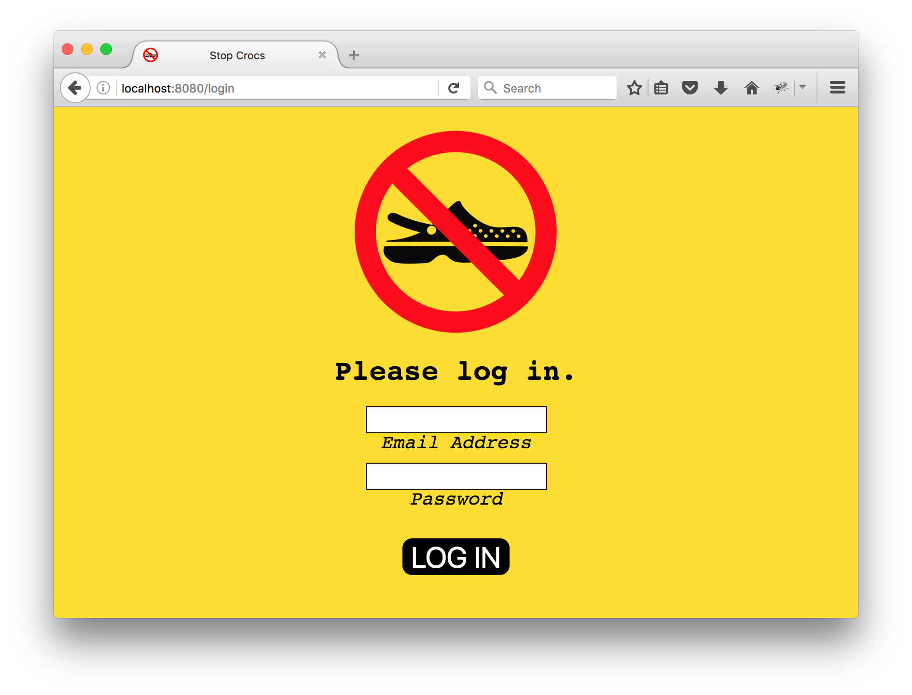

# Petition - Part 3

Let's add log in and registration to this thing.

You will need to add a `users` table to your database. The table should have columns for id (the primary key), first name, last name, email address, and the hashed password. You may also want to add a timestamp column to record the time at which the user was created.

You should also change the `signatures` table so that it has a column for the user id. You need to be able to map signatures to users and users to signatures.

Both the registration and log in forms can have several errors so you have to be able to reload them with error information displayed.

First name, last name, email address, and password should all be required fields. Email addresses must be unique. This should be enforced by a <a href="https://www.postgresql.org/docs/9.5/static/sql-createtable.html">constraint</a> on the column.

After users register or log in, you should attach a `user` object to `request.session`. You can check for the presence of this object to determine if the user is logged in. You should add to this object properties that you are likely to use frequently, such as the user's first name, last name, and signature id if the user has signed the petition.

Logged out users should be automatically redirected to the registration page.

Since users must be logged in to sign the petition, there is no need to ask them for their names on that form. Remove those inputs and use the first name and last name that is already stored.
