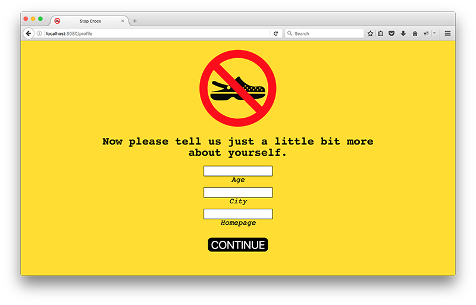
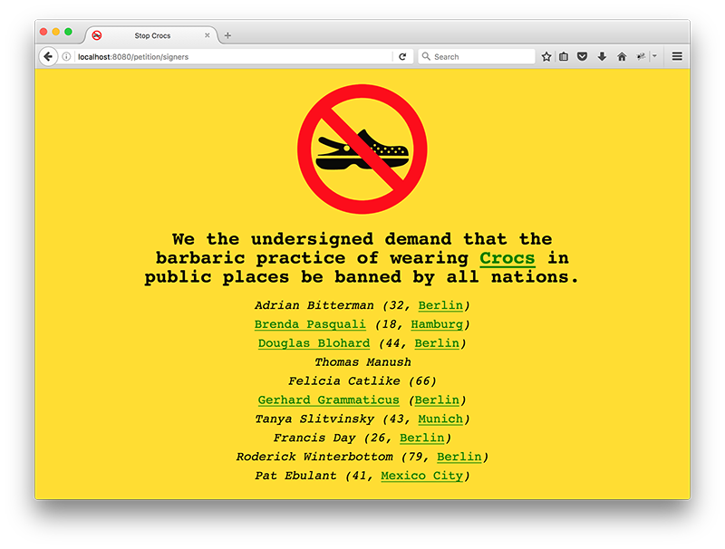
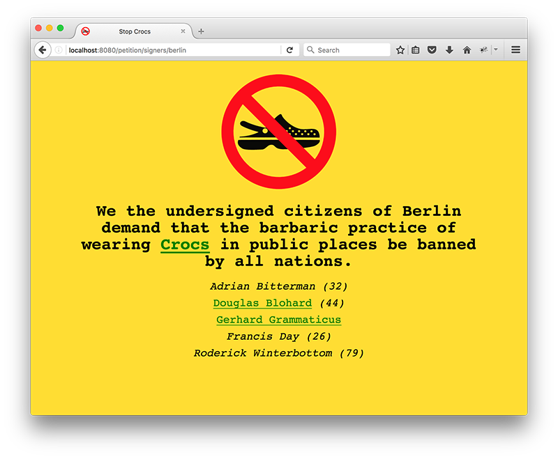

# Petition - Part 4

Immediately after registration, direct users to a new page that asks them to provide more information about themselves.

When the user submits this form, write this data to a new table named `user_profiles`. This table will need columns for id (primary key), user id (foreign key), age, city, and url.

All of the fields in this form are optional.

On the page listing all of the people who have signed the petition, show the additional profile information that is available. In the case of the homepage url, do not show it but rather link the name with the saved url in the `href` attribute.

The city names should also be links. When these links are clicked, users should be directed to a new page that shows only the people who have signed the petition that live in that city.

**Bonus**: Change the `signatures` table so that it no longer includes columns for first and last name. When showing the list of people who have signed the petition, get their names by joining the `users` table.
