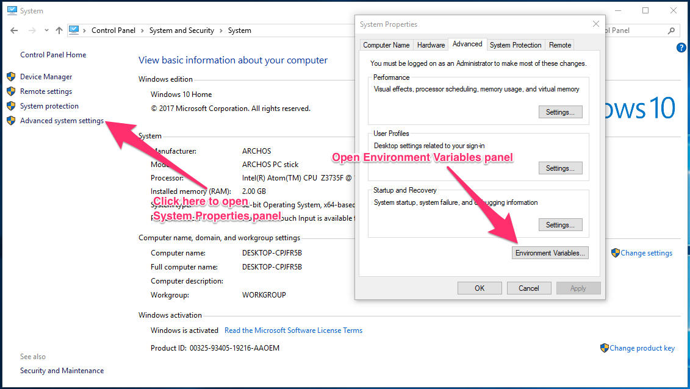
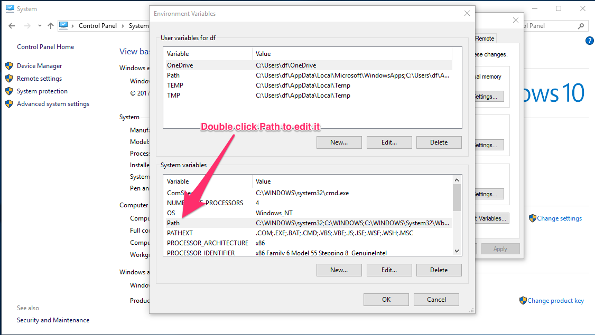
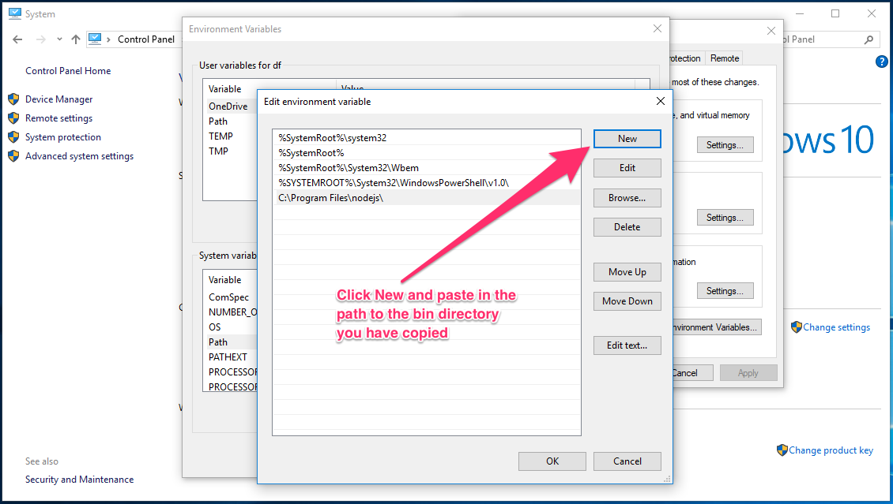

# Notes on Postgres Installation

## Installation Process

1. When installing EnterpriseDB, you will be asked for a password for the superuser. It is recommended that you make it "postgres".

2. You will be asked what port Postgres should run on. The default port is 5432 and it is easiest to keep it that way.

3. At the end of the installation, you will be asked to do more installation of a bunch of things using what they call "Stack Builder". You can cancel out of this nonsense.

## After Installation

If you attempt to run psql, the command line interface for Postgres, by typing `psql` in git-bash, you will most likely get a "Command not found" error. Although psql is installed, git-bash does not know where to find the program. You can fix this by updating your Path environment variable to include the path to psql.

To do this, you first have to know where psql is. Your Postgres installation is usually in your Program Files directory and psql will be in a subdirectory of a subdirectory of that. This directory should be named "bin" and will contain lots of stuff besides psql, including programs named "createuser" and "createdb." You will have to fish around with Windows Explorer to find bin. Once you do, you should copy the path to your clipboard.


The following screenshots, taken on Windows 10, explain how to update your Path environment variable starting from your Control Panel. If you are using a different version of Windows there may be slight variations in what you see but the process will be fundamentally similar.







After you have updated your Path, you will have to restart git-bash to be able to use psql. After restarting git-bash, you should be able to run psql by typing:

```
psql -U postgres
```

The `-U` parameter is the user of the database. Immediately after installation, there should be no defined user except the superuser named postgres. If you don't want to type `-U postgres` every single time you run psql, you can create a new user that has the same name as you on your computer. 

Unfortunately, the createuser program does not seem to work in git-bash. You will have to use the Windows command line, cmd. After you start cmd, you can type the following to create a new user:

```
createuser -U postgres -sP YOURUSERNAMEHERE
```

You will be asked twice for the password for the new user. After that, you will be asked for another password, that of the postgres user (which should be "postgres").

After you create a postgres user with same name as your user on your computer, you should be able to type `psql` into git-bash without getting a "Command not found" error. However, you will likely get another error due to there not being a database with the same name as your user. If you run psql without a `-d` parameter specifying the name of a database, it will assume that the database you want to run commands for has the same name as you. You haven't created a database with the same name as you but you can using the createdb program.

Unfortunately, the createdb program does not seem to work in git-bash. You will have to use the Windows command line, cmd. After you start cmd, you can type the following to create a new database:

```
createdb YOURDATABASENAMEHERE
```
