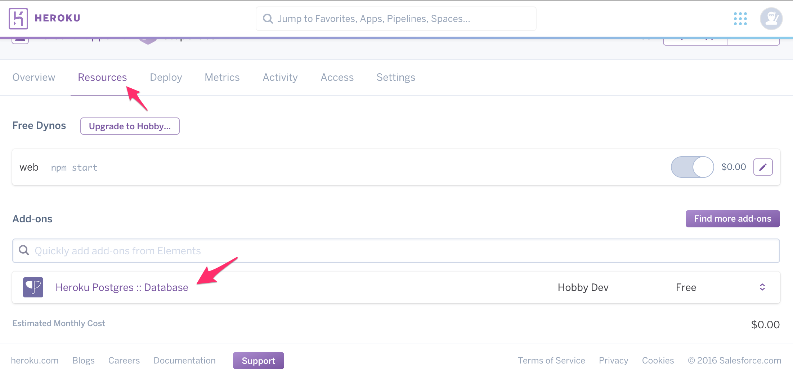
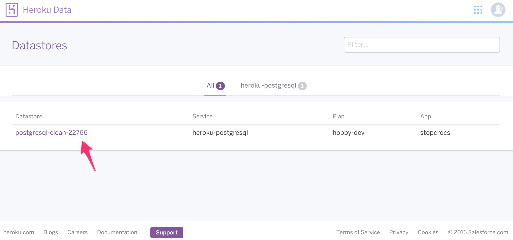
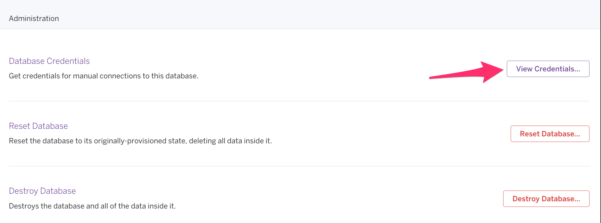
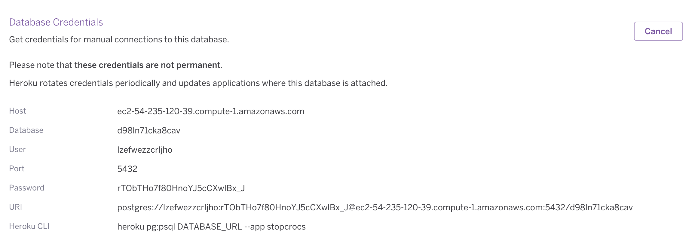
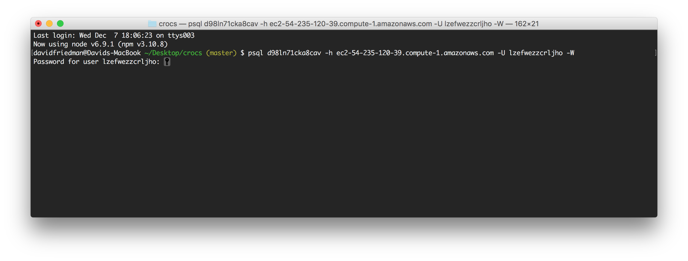

If you are encountering an error when you run `heroku pg:psql` you can do the following to work around the problem.

1. Go to the Resources tab and click on Heroku Postgres :: Database

    

2. A new tab will open up with a page in it that lists your data stores. Click on your Postgres item.

    

3. On the next page, scroll down to the Administration section and click the View Credentials button.

    

4. Run `psql` with the specified database name and the following additional parameters:

| param| value|
| ---- | ---- |
| -h   | host |
| -U   | user |
| -W   |      |

The -W flag will cause a prompt for your password to appear. Be sure to enter the password provided on the page.

After entering the password, you should be able to create your tables.
