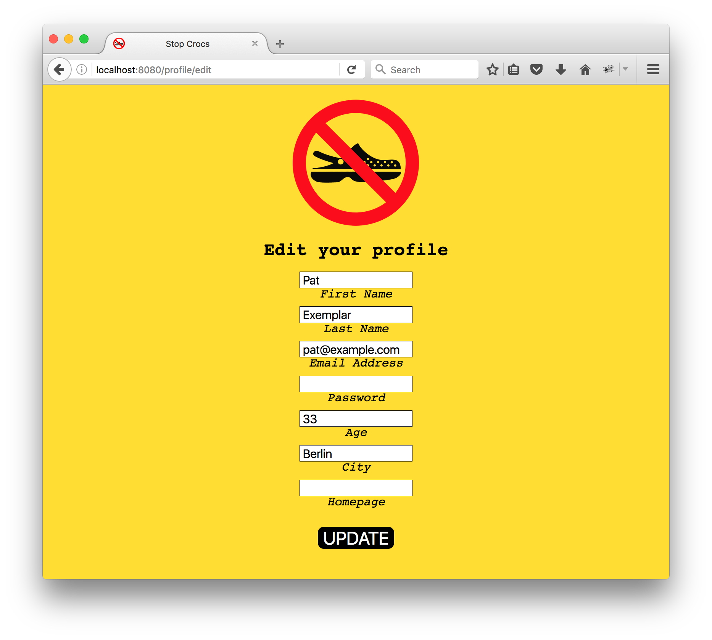
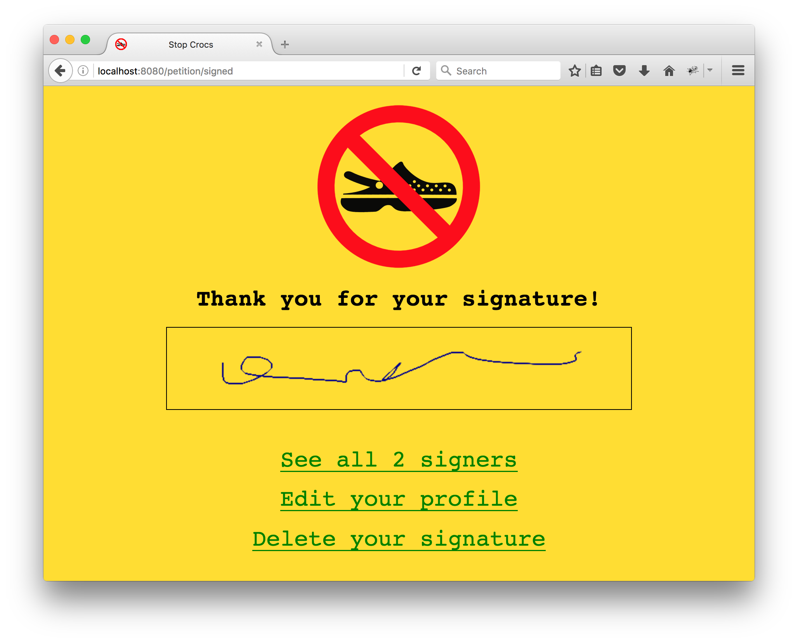

# Petition - Part 5

Let's allow users to edit all of the information they have provided about themselves.

Remember that age, city, and homepage url are optional fields. It is possible that the user doesn't even have a row in the `user_profiles` table. If that's the case, you should do an `INSERT` rather than an `UPDATE` with any data they enter into this form.

Remember also that we do not know the user's password. It is not a good idea to show them the hash we have stored. You should just leave the field blank but do hash and save whatever value gets submitted.

Let's also make it possible for users to unsign the petition.

After unsigning, logged in users should be redirected to the page on which they can sign the petition.
